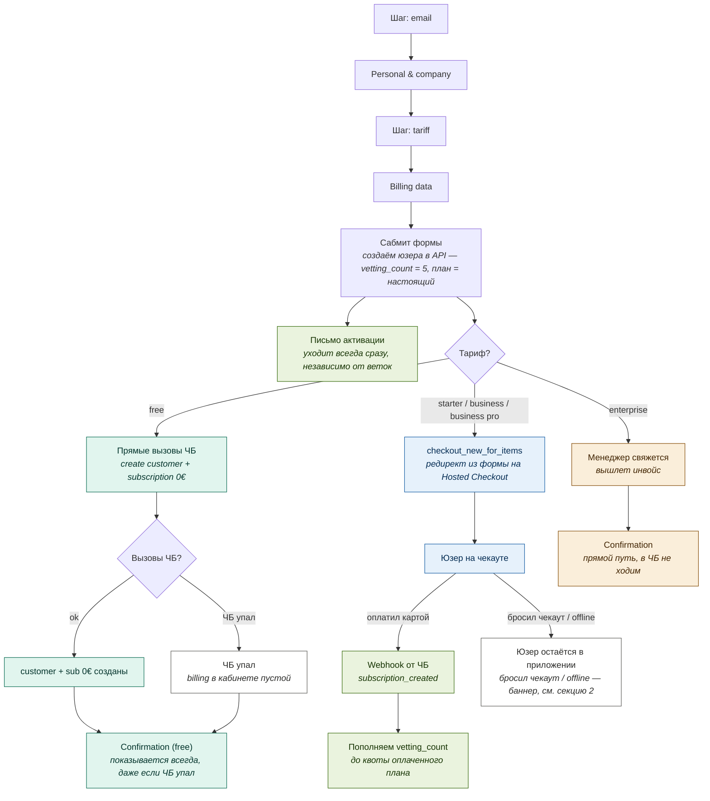
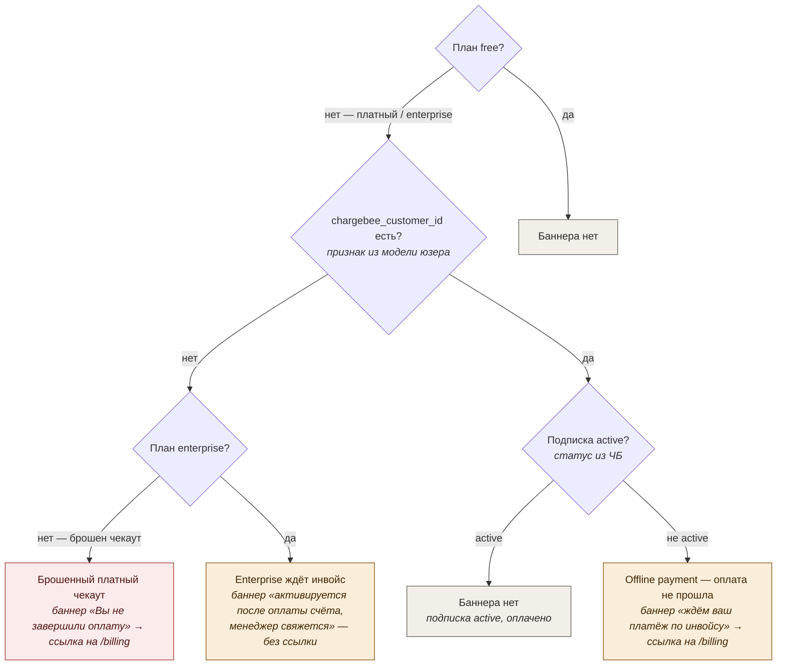

# CarrierCheck — блок-схема регистрации

Флоу регистрации в Chargebee-биллинге: форма → развилка по тарифу → чекаут → вебхуки → логика баннеров.

---

## 1. Регистрация: форма и развилка по тарифу

> Связка webhook ↔ юзер по **email** — нужно сделать email readonly в ЧБ.
> Доступ к проверкам гейтится квотой `vetting_count`, а не планом. Webhook при оплате пополняет квоту, план не трогает.

---

## 2. Определение баннера в приложении

Глобальный тост в хедере, на любой странице. Статус подписки тянется один раз за сессию.

### Как читается логика баннера

- Сначала проверяем `chargebee_customer_id` из модели юзера — если пусто, баннер определяется планом, запрос в ЧБ не нужен.
- Запрос статуса подписки в ЧБ — только когда `chargebee_customer_id` есть. Тянется один раз за сессию, хедер читает из стора.
- Доступность проверок (`vetting_count`) баннер не определяет — это отдельно решают webhook ЧБ и API.

| Состояние | Признак | Баннер |
|---|---|---|
| free | план free | нет |
| платный, нет `customer_id`, не enterprise | модель | «Вы не завершили оплату» → ссылка на /billing |
| enterprise, нет `customer_id` | модель | «активируется после оплаты счёта, менеджер свяжется» — без ссылки |
| есть `customer_id`, подписка active | ЧБ | нет |
| есть `customer_id`, подписка не active | ЧБ | «ждём ваш платёж по инвойсу» → ссылка на /billing |

---

## Ключевые решения

- **Billing data** в форме показывается только если тариф не free.
- **Письмо активации** уходит всегда сразу после сабмита, независимо от остальных веток.
- **Кастомер в API** создаётся на сабмите с настоящим планом и `vetting_count = 5`; доступ к проверкам гейтится квотой, а не планом.
- **free** — customer и подписка 0€ через прямые вызовы ЧБ. Если вызовы упали — юзер всё равно создан как free с 5 проверками, confirmation показывается, billing в кабинете пустой.
- **starter / business / business pro** — редирект из формы на Chargebee Hosted Checkout.
- **enterprise** — прямой путь к confirmation, в ЧБ не ходим; менеджер свяжется и вышлет инвойс.
- Webhook при оплате пополняет `vetting_count` до квоты плана. Связка webhook ↔ юзер по email — нужен readonly email в ЧБ.
